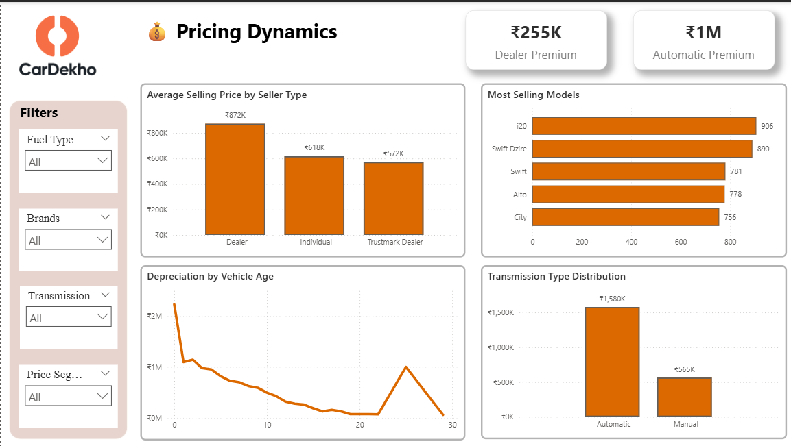
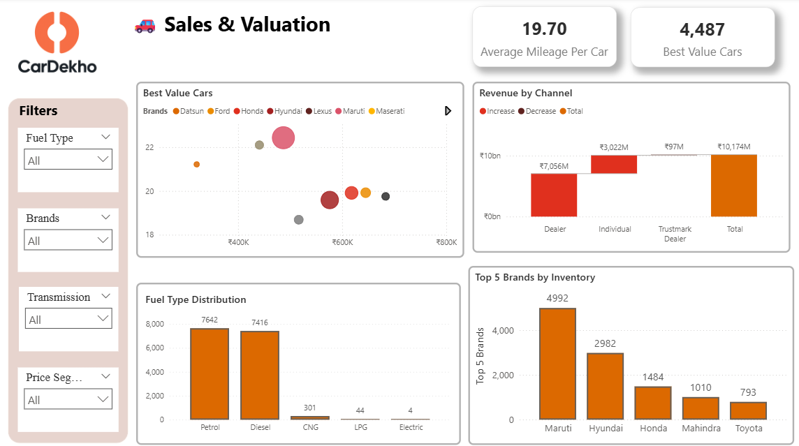

# 🚗 Car Dekho: Automotive Market Intelligence Platform


> **An end-to-end automotive analytics solution transforming raw marketplace data into actionable business intelligence**

## 🎯 Project Overview

This project demonstrates a comprehensive automotive analytics workflow that processes real-world car marketplace data to generate strategic business insights. Built for CarDekho's used vehicle marketplace, it enables data-driven inventory decisions and accurate price forecasting through advanced analytics and interactive visualizations.

**Data Pipeline Flow:**
```
Raw Data → ETL Processing → Feature Engineering → Power BI Dashboard
15,407 records → Data Cleaning → Preprocessing → DAX Measures
```

## 🛠️ Technology Stack

- **Data Processing:** Python (pandas, numpy)
- **Analytics:** Statistical modeling, Feature engineering
- **Visualization:** Power BI with advanced DAX measures
- **Data Modeling:** Dimensional modeling (Star schema)
- **Development:** Jupyter notebooks for iterative analysis

## 📁 Repository Structure

```
Car-Dekho-Project/
├── 📊 Data/
│   ├── cardekho_dataset.csv          # Raw vehicle dataset (15,407 records)
│   └── cardekho_cleaned.csv          # Processed dataset (15,244 records)
├── 📓 Notebooks/
│   └── CarDekho_Analytics_Pipeline.ipynb  # Main analysis pipeline
├── 📈 Power BI/
│   ├── Car Dekho Project.pbix        # Interactive dashboard
│   └── CarDekho_DAX_Measures.md      # DAX formulas documentation
├── 🖼️ Images/
│   ├── first.png                     # Market performance dashboard
│   ├── second_page.png               # Pricing intelligence view
│   ├── third_page.png                # Sales & value analytics
│   └── Car Dekho Dash Recording.mp4  # Dashboard demo video
├── 📋 requirements.txt               # Python dependencies
└── 📖 README.md                      # Project documentation
```

## 📊 Key Business Insights

| 🔍 Business Question | 📈 Data-Driven Finding |
|----------------------|------------------------|
| **Market Segmentation** | Premium (₹5-10L): **40.7%** dominates the market |
| **Vehicle Usage** | Average Usage: **48.6%**, Low Usage: **28.0%** |
| **Age Distribution** | Used (6-10y): **41.4%**, Recent (3-5y): **40.9%** |
| **Fuel Efficiency** | Average (15-20): **41.4%**, Good (20-25): **34.5%** |
| **Sales Channels** | Dealer premium analysis with revenue tracking |

## 💡 Strategic Recommendations

### 🎯 Portfolio Strategy
- **Focus Area:** Premium segment (₹5-10L) - 40.7% market share with higher margins
- **Sweet Spot:** Recent + Used vehicles (3-10 years) = 82.3% of market demand

### ⚡ Efficiency Optimization
- **Green Premium:** Good + Excellent mileage categories = 45.8% market opportunity
- **Value Proposition:** Average + Low usage vehicles = 76.6% of market

### 🏪 Channel Intelligence
- **Dealer Strategy:** Measurable premium tracking and optimization
- **Market Positioning:** Data-driven pricing for individual vs dealer channels

## 📸 Dashboard Visualizations

### Market Performance Overview

*Comprehensive market metrics, revenue analysis, and brand performance*

### Pricing Intelligence

*Price distribution, dealer premiums, and value retention analysis*

### Sales & Value Analytics

*Performance ratios, efficiency metrics, and market health indicators*

## 🎥 Demo

Watch the interactive dashboard in action: [Dashboard Demo Video](Images/Car%20Dekho%20Dash%20Recording.mp4)


## 🏷️ Tags

`#AutomotiveAnalytics` `#DataScience` `#PowerBI` `#BusinessIntelligence` `#PredictiveAnalytics` `#ETL` `#DataVisualization` `#MarketAnalysis`

## 📞 Contact

**Mayank Bisht**
- 💼 LinkedIn: [mayank-bisht-322051234](https://www.linkedin.com/in/mayank-bisht-322051234/)
- 📧 Email: mayankbisht9891@gmail.com
- 🌐 Portfolio: [Your Portfolio Link]

---

<div align="center">

**⭐ Star this repository if you found it helpful!**

*Built with ❤️ for the automotive analytics community*

</div>
